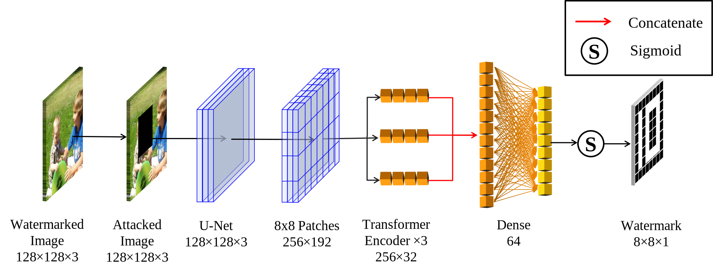

# VCTA-ImageWatermark

This project aims to implement an algorithm for embedding and extracting watermarks, along with various attack tests and performance evaluations.

## Directory Structure

```
./
├── .git                         # Git version control folder
├── .idea                        # Pycharm project configuration directory
├── datasets                     # Datasets
│   ├── COCO128                  # COCO128 dataset
│   └── Cifar128                 # Cifar128 dataset
├── logs                         # Log files
│   └── S128L64-F                # S128L64-F logs
├── models                       # Saved model files
│   └── S128L64-F                # S128L64-F model
├── plots                        # Charts and analysis
│   └── MainPlot.ipynb           # Main plotting notebook code
├── src                          # Source code
│   ├── run                      # Training-related code
│   │   ├── attacks_layer.py     # Attack layer implementation
│   │   ├── jpeg_attack.py       # JPEG attack implementation
│   │   ├── load_dataset.py      # Dataset loading
│   │   ├── loss_and_metric.py   # Loss and metric implementation
│   │   ├── main.py              # Main program entry
│   │   ├── main_model_v2.py     # Main model implementation
│   │   ├── my_callbacks.py      # Callback function implementation
│   │   ├── train_config.py      # Training configuration
│   │   ├── u_net_block.py       # U-Net module implementation
│   │   └── vit_embed.py         # ViT module implementation
│   └── test                     # Test code
│       ├── TestAttacks.py       # Attack tests
│       ├── TestResults.py       # Result tests
│       └── timeTest.py          # Time tests
├── TestResult                   # Test result output folder
└── ReadMe.md                    # ReadMe Markdown document
```

## Network Structure
### Embedding Network Structure
<div style="background-color: white; display: inline-block; padding: 10px;">
    
</div>

### Extraction Network Structure
<div style="background-color: white; display: inline-block; padding: 10px;">
    
</div>

## Install Dependencies

Before running the project, please ensure that the necessary dependencies are installed. You can install all dependencies using the following commands:

```bash
pip install tensorflow==2.15.1
pip install keras-cv
pip install matplotlib
pip install opencv-python
```

### Environment Requirements
- Since TensorFlow version 2.10.0, the GPU (CUDA) environment is no longer compatible with Windows; please consider using [WSL (Windows Subsystem for Linux)](https://learn.microsoft.com/en-us/windows/wsl/install) or a Linux system to run this project.
- TensorFlow == 2.15.0
- keras-cv
- matplotlib
- opencv-python

### Experimental Environment

- GPU: Tesla P40 (24G)
- CPU: E5 2680V2
- Memory: 64GB
- Operating System: WSL

## Model Structure
`./src/run/main_model_v2.py` contains the detailed definitions of the embedding and extraction model structures.

### Main Model Construction Method

```python
def main_model(embed, extr):
    pass
```

#### Functionality

Creates a complete model that includes embedding and extraction functions, as well as attack layers for training.

#### Parameters

- `embed (Model)`: Embedding model responsible for embedding the watermark into the image.
- `extr (Model)`: Extraction model used to extract the watermark from potentially attacked images.

#### Return Value

- `keras.Model`: A complete model that combines embedding and extraction functionalities.

### Embedding Model
```python
def embed_model():
    # input_image, input_watermark are model inputs built using the functional API
    # Embedding logic implementation
    # Uses U-Net and ViT models to construct the embedding model
    pass
```

#### Functionality
Builds a watermark embedding model.

#### Return Value

- `keras.Model`: Watermark embedding model.

### Extraction Model

```python
def extract_model(attacked_image):
    # Builds watermark image input using the functional API
    # Extraction logic implementation
    # Includes the use of U-Net and ViT structures, etc.
    pass
```

#### Functionality

Constructs a watermark extraction model.

#### Return Value

- `keras.Model`: Watermark extraction model.

## Usage

### Dataset Loading

Dataset loading is handled by the `load_dataset.py` file. It can load the COCO128 and Cifar128 datasets. Please place your custom datasets in the `datasets` folder, with the following directory structure:

```
datasets/
├── COCO128                  # COCO128 dataset
├── Cifar128                 # Cifar128 dataset
├── Custom Watermark Images  # Watermark image dataset
├── Custom Carrier Images    # Carrier image dataset
```

Loading custom dataset code:
```python
# Ensure that the 'Custom Carrier Images' and 'Custom Watermark Images' folders are in the ./datasets folder.
import load_dataset
test_dataset = load_dataset.ImageDataset(_image='Custom Carrier Images', _water='Custom Watermark Images')
```

### Model Training and Testing

`main_model_v2.py` contains the implementations of the embedding and extraction models. Training parameters can be configured using `train_config.py`. You can use `main.py` as the main entry point for training the model.

### Training Process Visualization
The `./src/run/my_callbacks.py` file defines the callback parameters during the training process, allowing you to visualize each epoch's training results by overriding methods like `on_epoch_end`.

### Using `TensorBoard`
To add custom monitoring variables: you need to inherit from `keras.layers.Layer` in your custom layer, and use `self.add_metric` in the overridden `forward` method to add monitoring to the `TensorBoard` panel.

Execute the following command to open the `TensorBoard` panel:
```bash
tensorboard --logdir 'logs/model_name/training_time(yy-mm-dd.HH-MM-SS)/'
# https://localhost:6006
```

### Attack Testing

Various attack methods, such as cropping, dropout, Gaussian noise, salt-and-pepper noise, Gaussian blur, etc., are defined in the `TestAttacks.py` file. You can call these methods to perform attack tests on the embedded images.

### Result Testing

The `TestResults.py` file is used to extract watermarks from attacked images and evaluate performance. Results will be saved in the `TestResult` directory.

### Time Testing

The `timeTest.py` file is used to test the time performance of embedding and extracting watermarks.

### Loading Saved Model Parameters
During model training, models with an average BER < 10% and the lowest BER will be automatically saved in the folder `./models/model_name/...`. To load a saved model for further training or testing, use the following example code:
```python
import keras
import main_model_v2
import train_config
embed_model = main_model_v2.embed_model(train_config.PSNR)
extr_model = main_model_v2.extract_model()
embed_model.load_weights(train_config.base_embed_model_dir) # Load parameters from embedding model path
extr_model.load_weights(train_config.base_extr_model_dir)   # Load parameters from extraction model
print(f"Loaded model from {train_config.model_name}")
```

## Configurable Parameters in `train_config.py`

- `activation`: Activation function, default value is 'gelu'.
- `attack_method`: Attack method, default value is 'all'.
- `learning_rate`: Initial learning rate, default value is 0.0001.
- `lr_stage`: Stages for learning rate adjustment.
- `lr_decay_rate`: Learning rate decay rate.
- `batch_size`: Batch size, default value is 96.
- `epoch_per_steps`: Steps per epoch, calculated based on `batch_size`.
- `epochs`: Total number of training epochs, default value is 1000.
- `PSNR`: Peak signal-to-noise ratio, default value is 40.
- `model_name`: Model name, dynamically generated based on `PSNR`.
- `main_path`: Main path, default value is './'.
- `image_size`: Image size, default value is 128.
- `water_size`: Watermark size, default value is 8.
- `time_str`: Timestamp included in log directory, default value is the current time.
- `log_dir`: Log directory, dynamically generated based on `model_name` and `time_str`.
- `embed_model_dir`: Embedding model directory, dynamically generated based on `model_name`.
- `extr_model_dir`: Extraction model directory, dynamically generated based on `model_name`.
- `stn_model_dir`: STN model directory, dynamically generated based on `model_name`.
- `base_embed_model_dir`: Base embedding model directory.
- `base_extr_model_dir`: Base extraction model directory.
- `base_stn_model_dir`: Base STN model directory.
- `image_dir`: Image save directory.
- `dataset_base_path`: Base path for datasets.
- `train_image`: Training image dataset

 name.
- `test_image`: Testing image dataset name.
- `train_water`: Training watermark dataset name.
- `test_water`: Testing watermark dataset name.

## File Descriptions

- `attacks_layer.py`: Implements classes and functions for various attack methods.
- `jpeg_attack.py`: Implements JPEG compression attacks.
- `load_dataset.py`: Responsible for loading the COCO128 and Cifar128 datasets.
- `loss_and_metric.py`: Defines loss functions and evaluation metrics.
- `main.py`: The main entry of the project for training and testing the model.
- `main_model_v2.py`: Contains implementations of the embedding and extraction models.
- `my_callbacks.py`: Implements callback functions for executing specific operations during training.
- `train_config.py`: Configures training parameters.
- `u_net_block.py`: Implements U-Net modules.
- `vit_embed.py`: Implements ViT embedding.
- `TestAttacks.py`: Defines methods for attack testing.
- `TestResults.py`: Used to extract watermarks from attacked images and evaluate performance.
- `timeTest.py`: Used to test the time performance of embedding and extracting watermarks.

## Notes

1. Ensure that TensorFlow and Keras are installed.
2. Use a GPU for training and testing to improve performance; ensure GPU memory ≥ 16GB when training.
3. Result files will be saved in the `TestResult` directory; please ensure this directory exists and has write permissions.
4. If there are issues with the project directory during execution, ensure that the root directory is the project directory.

## Contact Information

Email: 1046714542@qq.com